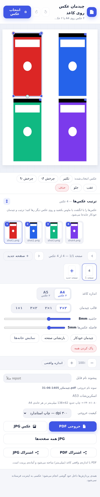
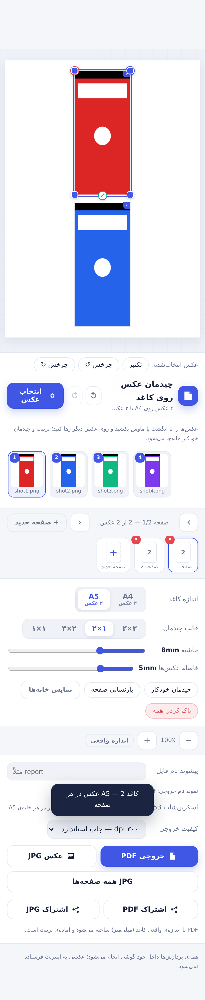

# چیدمان عکس روی کاغذ (A4 / A5)

یک وب‌اپ قابل نصب (PWA)، کاملاً آفلاین و بدون سرور، برای چیدن اسکرین‌شات‌ها و عکس‌ها روی کاغذ چاپی. تمام پردازش‌ها داخل خود مرورگر انجام می‌شود و هیچ عکسی به اینترنت فرستاده نمی‌شود.

📄 [English README](./README.md) — شامل راهنمای کامل تبدیل به اپ موبایل با Capacitor




## امکانات

- **چیدمان خودکار**: A4 → ۴ عکس (۲×۲) و A5 → ۲ عکس (۱×۲) — قالب‌های ۱×۱/۲×۱/۲×۲/۲×۳
- **ویرایش دستی هر عکس**: جابه‌جایی، بزرگ/کوچک (دستگیره‌های گوشه)، چرخش (دستگیره بالا)، کراپ/پرکردن کادر (دستگیره سبز)، آوردن به رو/زیر، تکثیر، حذف
- **نوار ترتیب‌گذاری با درگ**: عکس‌ها را با انگشت یا ماوس بکشید و روی عکس دیگر رها کنید؛ چیدمان خودکار بلافاصله با ترتیب جدید ساخته می‌شود
- تنظیم **حاشیه کاغذ** و **فاصله بین عکس‌ها**، چند صفحه، Undo/Redo، نوار بندانگشتی صفحه‌ها
- خروجی **PDF با اندازه واقعی میلی‌متری** (آماده پرینت) و **JPG** با ۱۵۰ یا ۳۰۰ dpi (یک صفحه یا همه صفحه‌ها)
- نام‌گذاری خروجی‌ها: **پیشوند دلخواه + زیرخط + تاریخ شمسی** (مثلاً `report_1404-06-30.pdf`) — پیشوند در خود اپ ذخیره می‌شود
- **اشتراک‌گذاری به‌صورت فایل** (Web Share API): مستقیم به منوی اشتراک گوشی؛ در مرورگرهای بدون پشتیبانی، فایل دانلود می‌شود
- ابعاد اسکرین‌شات **سامسونگ A53 (۱۰۸۰×۲۴۰۰)** به‌عنوان مبنا لحاظ شده و اندازه چاپی آن روی کاغذ فعلی نمایش داده می‌شود
- با Service Worker آفلاین کار می‌کند و روی گوشی مثل اپ نصب می‌شود (منوی مرورگر → «Add to Home screen»)

## اجرا

بدون هیچ بیلد یا وابستگی — کافی است پوشه را با یک سرور استاتیک سرو کنید:

```bash
cd photo-arranger
python3 -m http.server 8000
```

## تست‌ها

```bash
# ۱) تست واحدِ PDF‌ساز (ساخت PDF با node و اعتبارسنجی هندسه با pypdf)
cd test && node build-pdf-test.js && python3 verify_pdf.py && cd ..

# ۲) تست سرتاسری در مرورگر واقعی (۲۸ بررسی)
pip install playwright pypdf && python3 -m playwright install chromium
python3 test/browser_e2e.py
```

## ساختار

- `index.html` — رابط کاربری فارسی (RTL)
- `styles.css` — تم روشن و مینیمال
- `js/app.js` — منطق چیدمان، ویرایش لمسی، رندر Canvas، خروجی JPG/PDF و اشتراک‌گذاری
- `js/pdf-writer.js` — تولیدکننده PDF سبک و دست‌نویس بدون کتابخانه (DCTDecode برای JPEGها)
- `js/jalali.js` — تبدیل تاریخ میلادی به شمسی
- `sw.js` / `manifest.webmanifest` / `icons/` — نصب و کارکرد آفلاین
- `test/` — تست‌های واحد و سرتاسری به‌همراه فایل‌های نمونه

## تبدیل به اپ موبایل

این پروژه یک وب‌اپ استاتیک استاندارد است و با **Capacitor** به‌راحتی به اپ اندروید/iOS تبدیل می‌شود. راهنمای گام‌به‌گام به همراه چک‌لیست فنی (به‌ویژه پل‌زدن `shareBlob`/`downloadBlob` به `@capacitor/share` و `@capacitor/filesystem`) در بخش *«Converting to a mobile app»* فایل [README.md](./README.md) آمده است. فایل آماده `capacitor.config.json` هم در ریشه پروژه قرار دارد.

## لایسنس

MIT — فایل [LICENSE](./LICENSE) را ببینید.
